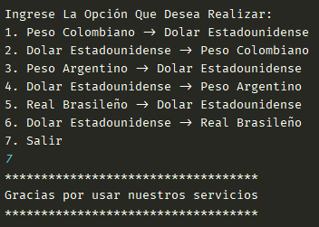

# challengeConversorMoneda

En este repositorio se encuentra la solucion al challenge conversor de moneda para alura latam

## Corriendo el proyecto

1. Ingresamos al archivo `Main.java`

2. corremos el proyecto `control + shift + f10`

3. abrirá una terminal como la siguiente:

    

4. Escribimos el número de una de las opciones (por ejemplo la opcion 2) y presionamos enter
    Aparecerá lo siguiente:

    

5. Ingresamos la cantidad que deseamos convertir y presionamos enter

    Esto nos mostrará el mensaje con el valor convertido y se reiniciará el menú para que podamos repetir los pasos hasta seleccionar la opción 7

    

6. Si seleccionamos la opción 7 aparecerá el siguiente mensaje y dará por terminada la ejecución del programa:

    

